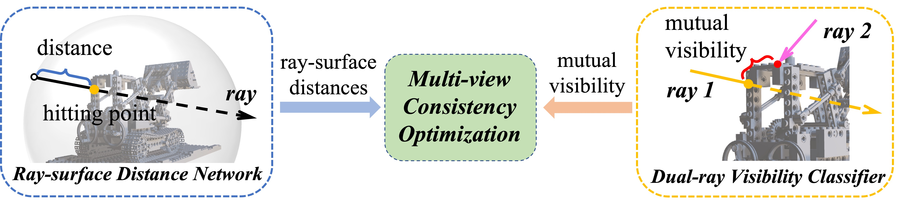

[//]: # ([![arXiv]&#40;https://img.shields.io/badge/arXiv-2305.16404-b31b1b.svg&#41;]&#40;https://arxiv.org/abs/xxxx&#41;)
[](https://creativecommons.org/licenses/by-nc-sa/4.0/legalcode)
[](https://twitter.com/vLAR_Group)

## RayDF: Neural Ray-surface Distance Fields with Multi-view Consistency (NeurIPS 2023)
[**Project page**](https://vlar-group.github.io/RayDF.html) |  [**Paper**](xxx) | [**Data**](https://drive.google.com/drive/folders/1ELzsdlc1Bd5C97EHn5P_k8qqM7ZKEFHF?usp=drive_link)

<p align="center">  </p>

We present a novel ray-based continuous 3D shape representation, called **RayDF**. Our method achieves a **1000x faster** speed than coordinate-based methods to render an 800 x 800 depth image.

[//]: # ()
[//]: # (|        Blender: Lego         |        DM-SR: Restroom        |      ScanNet: Scene0004_00      |)

[//]: # (|:----------------------------:|:-----------------------------:|:-------------------------------:|)

[//]: # (| ![]&#40;static/blender_lego.gif&#41; | ![]&#40;static/dmsr_restroom.gif&#41; | ![]&#40;static/scannet_scene04.gif&#41; |)


## 1. Installation
Create a Conda environment with [miniconda](https://docs.conda.io/en/latest/miniconda.html).

```bash
conda create -n raydf python=3.8 -y
conda activate raydf
```

Install all dependencies by running:

```bash
# install PyTorch
pip install torch==1.12.1+cu113 torchvision==0.13.1+cu113 --extra-index-url https://download.pytorch.org/whl/cu113
# install other dependencies
pip install -r requirements.txt
```

## 2. Datasets
In this paper, we conduct experiments on the following three datasets:
- **Blender** [2.03GB] [[Google Drive]](https://drive.google.com/file/d/1xjGKFszIP8dX7i_kOFq3RFZ7tSJHzPQM/view?usp=drive_link)[[Baidu Netdisk]](https://pan.baidu.com/s/1XHNdukNjx2BsNh_jBUrJfA?pwd=vlar): We use 8 objects from the realistic synthetic 360-degree Blender dataset.
- **DM-SR** [1.71GB] [[Google Drive]](https://drive.google.com/file/d/14bxsM1a9QnP9b7GHBFuU6ln1nq03Qsy9/view?usp=drive_link)[[Baidu Netdisk]](https://pan.baidu.com/s/17FBP0D2KMisEl2H4rO96vQ?pwd=vlar): We use 8 synthetic indoor scenes from the DM-SR dataset. 
- **ScanNet** [4.34GB] [[Google Drive]](https://drive.google.com/file/d/1UzJzcgBkGo6KfhZMLFCikXoaXptbWPF-/view?usp=drive_link)[[Baidu Netdisk]](https://pan.baidu.com/s/1h7UIgWtGQOAGYd0wdAAOXw?pwd=vlar): We use 6 scenes `scene0004_00, scene0005_00, scene0009_00, scene0010_00, scene0030_00, scene0031_00` from the ScanNet dataset. 

The pre-processed data can be automatically downloaded by running the following script:
```bash
# download all datasets
sh datasets/download.sh
# download one of the datasets
sh datasets/download.sh blender
sh datasets/download.sh dmsr
sh datasets/download.sh scannet
```


 
## 3. Training

To train a dual-ray visibility classifier for different scenes by specifying `--scene`: 
```bash
CUDA_VISIBLE_DEVICES=0 python run_cls.py --config configs/blender_cls.txt --scene lego
CUDA_VISIBLE_DEVICES=0 python run_cls.py --config configs/dmsr_cls.txt --scene bathroom
CUDA_VISIBLE_DEVICES=0 python run_cls.py --config configs/scannet_cls.txt --scene scene0004_00
```
After finishing the training of classifier, modify `ckpt_path_cls` in the config file 
and train the ray-surface distance network:
```bash
CUDA_VISIBLE_DEVICES=0 python run_mv.py --config configs/blender.txt --scene lego
CUDA_VISIBLE_DEVICES=0 python run_mv.py --config configs/dmsr.txt --scene bathroom
CUDA_VISIBLE_DEVICES=0 python run_mv.py --config configs/scannet.txt --scene scene0004_00
```
To train a ray-surface distance network with radiance branch by specifying `--rgb_layer`:
```bash
CUDA_VISIBLE_DEVICES=0 python run_mv.py --config configs/blender.txt --scene lego --rgb_layer 2
```
Alternatively, we provide a script for easy sequential training of the classifier and ray-surface distance network:
```bash
sh run.sh <gpu_id> <dataset_name> <scene_name>
# e.g., sh run.sh 0 blender chair
```

## 4. Evaluation

To evaluate the dual-ray visibility classifier:
```bash
CUDA_VISIBLE_DEVICES=0 python run_cls.py --config configs/blender_cls.txt --scene lego --eval_only
```
To evaluate the ray-surface distance network:
```bash
CUDA_VISIBLE_DEVICES=0 python run_mv.py --config configs/blender.txt --scene lego --eval_only
# remove outliers
CUDA_VISIBLE_DEVICES=0 python run_mv.py --config configs/blender.txt --scene lego --eval_only --denoise
# compute surface normals
CUDA_VISIBLE_DEVICES=0 python run_mv.py --config configs/blender.txt --scene lego --eval_only --grad_normal
```
The checkpoints of three datasets are free to download from [Google Drive](https://drive.google.com/drive/folders/1lnCNf27c_loQMaPCAIu-GIVeBWHlZ23T?usp=sharingv) or [Baidu Netdisk]() (Coming soon).


### Citation
If you find our work useful in your research, please consider citing:


### License
Licensed under the CC BY-NC-SA 4.0 license, see [LICENSE](./LICENSE).
